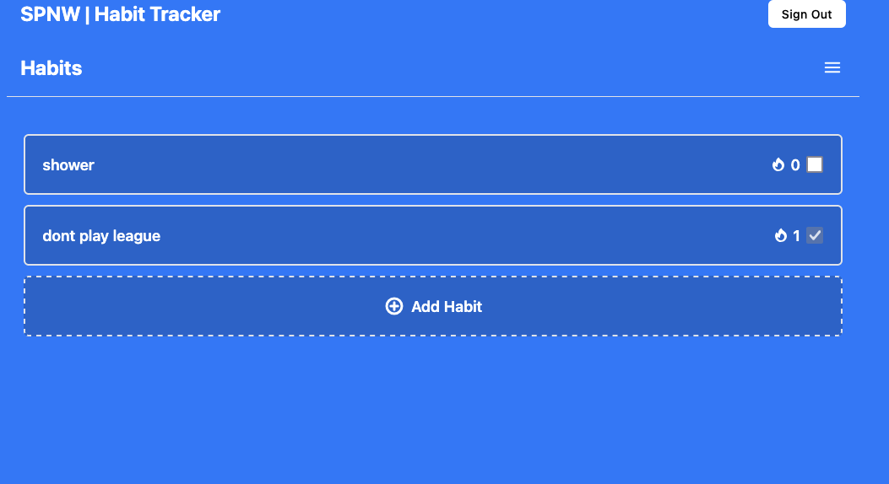

# SPNW - Simple, Personal, and New Way to Track Habits

Welcome to **SPNW**, a modern, lightweight habit tracker designed to help you stay on top of your goals. Built with **FastAPI** on the backend, and **HTMX**, **Alpine.js**, and **TailwindCSS** on the frontend, SPNW combines powerful functionality with a sleek, responsive design.

---

## Features

- **Dynamic Habit Tracking**: Add and remove habits with ease.
- **Streak Management**: Visualize your habit streaks to stay motivated.
- **Real-Time Updates**: Interact with the app seamlessly using HTMX and Alpine.js.
- **Customizable UI**: Enjoy a clean and minimalist interface powered by TailwindCSS.
- **Secure and Scalable**: Built with FastAPI for a robust and performant backend.
- **MongoDB Integration**: Store and manage data efficiently with MongoDB.
- **Nix Support**: Easy environment setup with reproducible builds.
- **Docker Support**: Containerize and deploy the app effortlessly.

---

## Tech Stack

### Backend
- **[FastAPI](https://fastapi.tiangolo.com/)**: A modern web framework for building APIs with Python.
- **[MongoDB](https://www.mongodb.com/)**: A NoSQL database for flexible and scalable data storage.

### Frontend
- **[HTMX](https://htmx.org/)**: Enables seamless, AJAX-like updates for dynamic interactions.
- **[Alpine.js](https://alpinejs.dev/)**: Lightweight JavaScript framework for interactivity.
- **[TailwindCSS](https://tailwindcss.com/)**: Utility-first CSS framework for a responsive and beautiful design.

### Tools
- **[Nix](https://nixos.org/)**: For reproducible and consistent development environments.
- **[Docker](https://www.docker.com/)**: For containerized development and deployment.

---

## Installation and Setup

### Prerequisites
- Python 3.9+
- MongoDB (local or cloud instance)
- [Nix](https://nixos.org/download.html)
- Docker (optional, for containerised deployment)

---

### Using Nix

1. Clone the repository:
   ```bash
   git clone https://github.com/yunz-dev/spnw.git
   cd spnw
   ```
2. Enter nix-shell via flake:
```bash
    nix develop
```
3. Install Python dependencies inside the Nix environment:
```bash
    pip install -r requirements.txt
```
4. Run the development server:
```bash
   uvicorn app.main:app --reload
```

### Environment Variables

Make sure to set up a .env file in the root directory with the following variables:
```bash
MONGODB_URI=mongodb+srv://<username>:<password>@<cluster>.mongodb.net/<database_name>?retryWrites=true&w=majority
```
Replace <username>, <password>, <cluster>, and <database_name> with your MongoDB credentials.
 e

## Screenshots


## License

This project is licensed under the [GPL](https://www.gnu.org/licenses/gpl-3.0.en.html) License.
